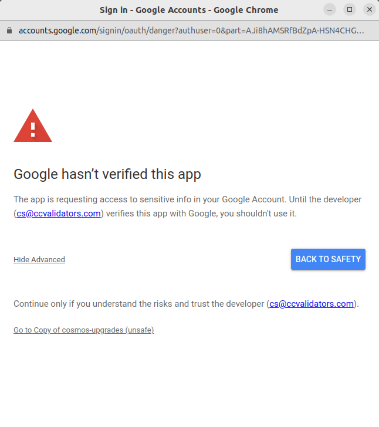

# Apps Script Setup for automated Cosmos Upgrades in Google Calendar 📅

Seamlessly integrate the `cosmos-upgrades` into your Google Calendar using Google Apps Script. This guide walks you through setting up the script.

## Features 🚀

- Directly pulls upgrade events from the `cosmos-upgrades` API.
- Automatically creates Google Calendar events for each discovered upgrade.
- Supports all calendar types (private, shared, public)
- Automatically updates calendar events every `15min`
- Requires minimal setup and runs on Google's infrastructure.

## Prerequisites 📜

1. A Google account.

## Setup Guide 🛠️

### 1. Fork the Script

- Navigate to the Google Apps Script project page: **[Google Script Project](https://script.google.com/home/projects/1IU3doZX1iY20JJ_DbwRNOwuufWIrLCqgFauwTsfp3d9jyxPYTViTXBte)**
- On the project overview page, hit the **Copy** button located at the top right.
- This creates your personal copy of the script and gives you full control and ownership, which is needed for the automatic update function to work!

### 2. Deploy

- Inside the Google Apps Script editor, hit the **Deploy** button and choose **New Deployment**.
- In **Who has access to the app**, pick **Only myself**.
- For **Execute the app as**, choose **Me (your email)**.
- Press **Deploy**.

### 3. Call the web app & Authenticate

- Post-deployment, you're given a unique URL. Click to this URL to open it in your web browser.
- When calling the URL for the first time, you need to authenticate the Script to access your Google Calendar events and connect to external services.
- On the Sign-in page, click on "Advanced" > "Go to Copy of cosmos-upgrades (unsafe)" > "Allow"

You can now select your calendar(s), and which mainnets and testnets you want to receive updates for.

Hit the `Add cosmos-upgrades to calendar` button save your settings and add upgrade events from your network list.

## Disclaimer 💡

Though well-tested, this tool is experimental and relies on external Services and Google's infrastructure. Use it at your own risk!

If you encounter any problems or bugs please use this repository to open a new issue.

## License 📄

This guide and associated scripts are open-sourced under the MIT license. Modify, use, and share them!

---

Never miss a cosmos upgrade! 🎉
